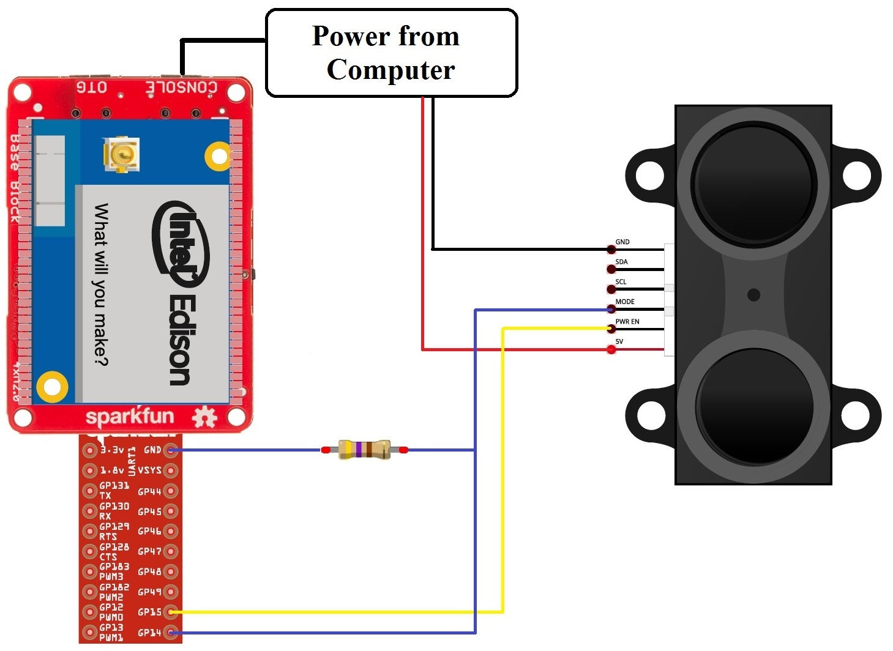

# edison_lidarLite-PWM

This sample is designed for LIDAR-Lite v1 "Silver Label," but should work 
with LIDAR-Lite v2 using the same wiring (but add a 680uF capacitor 
because of the speed!).

lidarLite_PWM_read.c reads the PWM output of PulsedLight's LidarLite using 
Intel's mraa Library and prints the distance in meters. 

Pin 2 of the LidarLite is connected to GPIO15 of the Intel Edison. Pin 3 is 
connected to GPIO14 with a 470 ohm resistor to ground. Since the LidarLite 
ideally runs at around 5 V, use an external power supply that uses the same 
ground as the Edison. This program was tested by powering both the Edison and 
the LidarLite over USB from the same computer.

 

The constant `OFFSET` is used in case that the LidarLite is measuring with an 
offset. Assign a value that will be subtracted from the measured value. 

Tested in Ubilinux. Compile with the following command: 

```
gcc lidarLite_PWM_read.c -lmraa -lrt
```
